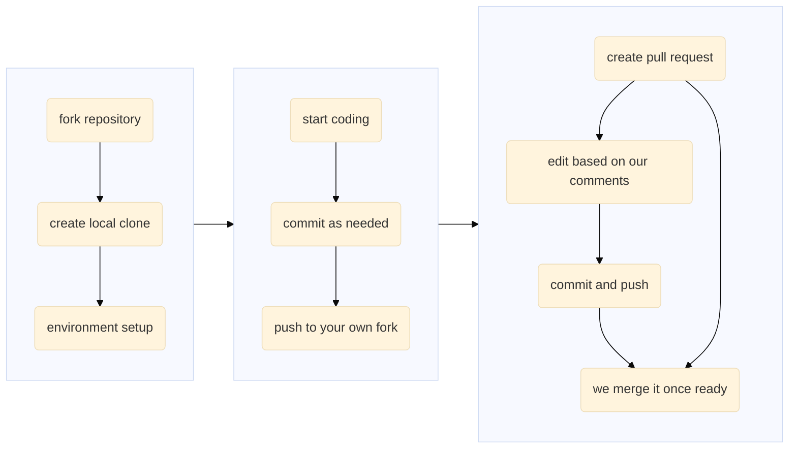

# Contribute to `cofi-examples`

Thanks for considering contributing :tada:! You don't have to know all of the details
in order to contribute, and we welcome contributions of any forms (e.g. issues,
pull requests, etc.). If you've read the instructions below and are still unsure
where to start, feel free to contact us via [Slack](https://inlab-geo.slack.com/).

## ***To report bugs or typos***
Please head to either [GitHub issues](https://github.com/inlab-geo/cofi-examples/issues) 
or our [Slack workspace](https://inlab-geo.slack.com/).

## ***To add a domain-specific (e.g. geoscience) example***
Here is a general workflow in a contribution process:



1. Fork this repository by clicking the "Fork" button on top right
2. Clone your own version of this repository
   ```console
   $ git clone https://github.com/<your-github-id>/cofi-examples.git
   ```
   replacing `<your-github-id>` with your actual id
3. Run `python utils/generate_example/create_new_example.py <example-name>`, replacing `<example-name>` with
   the problem you are going to describe and run inversion on.
4. You will then notice that inside the folder `notebooks/<example-name>` there are 
   three template files. Please try not to change the file names, but if you won't 
   need to import data or extra library, feel free to delete them safely and leave only
   the `.ipynb` file in the folder.
5. While experimenting with `cofi`, feel free to reference our 
   [documentation](https://cofi.readthedocs.io/en/latest/), particularly the
   [tutorials](https://cofi.readthedocs.io/en/latest/tutorial.html) and
   [example gallery](https://cofi.readthedocs.io/en/latest/cofi-examples/_sphinx_gallery/generated/index.html)
6. Once finished coding your notebook, commit and push your changes to your own fork
   ```console
   $ git add notebooks/<your-example-name>.ipynb notebooks/other-auxiliary-files.py
   $ git commit -m "feat: a <topic> example created by <your name>"
   $ git push origin main
   ```
   Please note that we aim to use [Angular style](https://github.com/angular/angular.js/blob/master/DEVELOPERS.md#-git-commit-guidelines) 
   commit messages throughout our projects
7. Head to your fork of this repository (`https://github.com/<your-github-id>/cofi-examples`),
   now you should be able to see your changes in effect. On top of your latest commit
   message, click the "Contribute" button -> "Open pull request", and write a description
   and continue as prompted
8. That's it. We will be able to see your code contribution once you've
   submitted the pull request, and will review and merge as soon as we can. Once
   approved and merged, your example will be added to CoFI 
   [example gallery](https://cofi.readthedocs.io/en/latest/cofi-examples/_sphinx_gallery/generated/index.html)
   automatically
