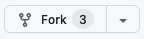
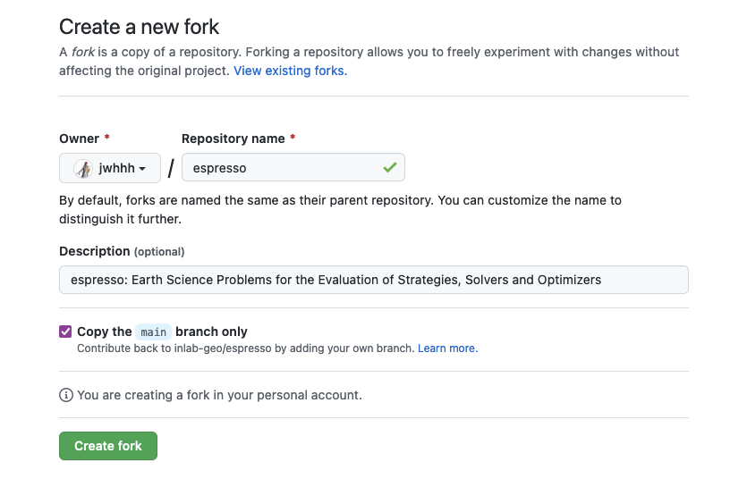
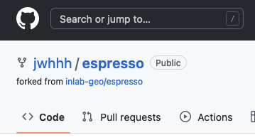
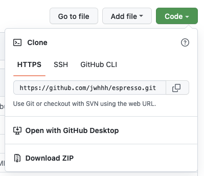

====================
New Espresso problem
====================

👋 Everyone is welcomed to contribute with their own forward code. We aim to reduce the
barrier of contributing so don't worry if you are not familiar with those technical
stuff like git operations - we are here to help.

There are generally three steps involved in submiting your code:

- **Download** - :ref:`get a copy of Espresso <get_own_copy>`
- **Edit** - :ref:`add in your own Espresso problem <add_contrib>`
- **Upload** - :ref:`submit your changes to our main repository <submit_changes>`

In the following paragraphs, we are going to show you how to complete each of the steps
above. Again, feel free to `contact us <faq.html>`_ when in doubt.

.. _get_own_copy:

Get your own copy of Espresso
-----------------------------

1. Open your browser and go to the Espresso `repository`_.
2. Ensure you have a GitHub account and it's signed in. If not, click the "Sign Up"
   button on the top right and fill in the necessary information to sign up an account.
3. Now click the "Fork" button on the top right.

4. Leave everything by default and click the green "Create fork" button.

5. Now you will be redirected to your own "fork" of the Espresso repository.

    This fork is your own version of Espresso, and you can make changes however you 
    want. We will later demonstrate that after you make your own changes, you are
    able to "contribute" back to the main repository.

6. We will clone your fork into your local machine. Click the green "Code" button first, 
   and then copy the content under the "HTTPS" tab.

7. Clone your fork to somewhere in your computer.

   - For **MacOS** and **Linux** users, open your "Terminal" app, change your working 
     directory into somehwere you'd like to place the Espresso code, then run the 
     :code:`git clone` command as following.
   - For **Windows** users, please install `git <https://git-scm.com/downloads>`_ first, 
     and open "Git Bash" to run the following commands. In the steps afterwards, it's
     always "Git Bash" when we refer to a "terminal" if you are on Windows.

.. code-block:: console

    cd <path-to-espresso>
    git clone <url-you-copied-in-step-6>

.. attention::

    If this is the first time you clone a GitHub repository, it's very likely that you 
    will need a personal access token as your password. Check out this page:
    `creating a personal access token <https://docs.github.com/en/authentication/keeping-your-account-and-data-secure/creating-a-personal-access-token>`_
    for how to create a personal access token, and use it as your password when you are
    asked to enter it in the terminal.

8. Open :code:`<path-to-espresso>/espresso` folder with your favourite code editor. 
   You will see a copy of Espresso in front of you, cheers ☕️! 

.. _add_contrib:

Add your own Espresso problem
-----------------------------

1. Let's now ensure that you have a Python installed.

.. _submit_changes:

Submit your changes
-------------------

