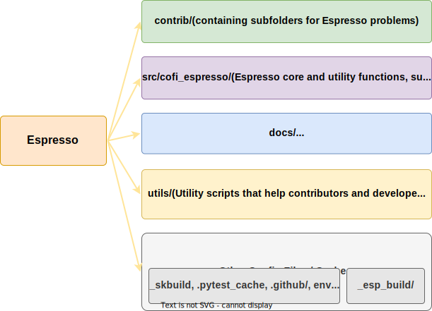

================
Folder structure
================

- Folder **contrib/** contains subfolders for each Espresso problem. Each Espresso
  problem has a self-contained subfolder with :code:`problem_name` as the folder name.

- Folder **src/espresso/** contains Espresso core functions and the base class
  :code:`EspressoProblem`. Contributors typically install these functions before they
  start developing a new problem, so that they get access to the base class and utility
  functions.

  - If you'd like to improve base class specification or :code:`espresso.utils`,
    this is the place to edit.

  - If you'd like to bump the version, change file :code:`src/espresso/version.py`.

- Folder **espresso_machine/** has all the utility scripts to be used by contributors and 
  developers.

- Folder **_esp_build/** will contain temporary Python package source files after you
  build :code:`espresso`.

  - These are built files, so you never have to change the contents under this folder. 
    If you feel something's wrong in this folder, look for the source from the three 
    folders above.
